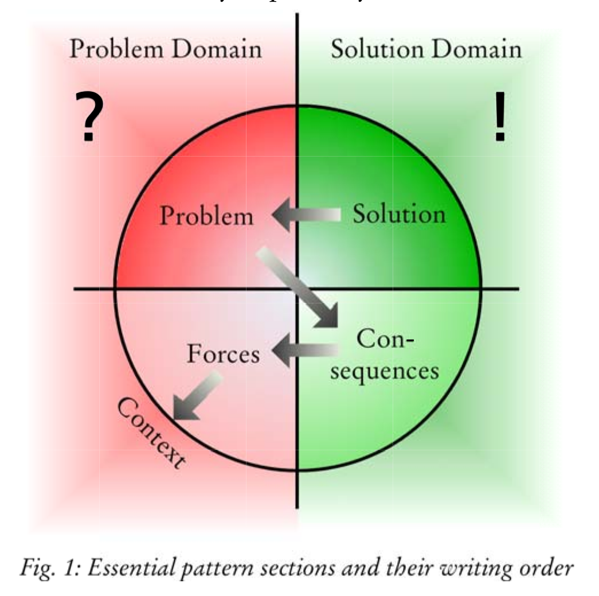

# Code pour le Sénégal patterns

Ce document est un guide d'aide à la rédaction d'un pattern pour l'initiative **Code Pour Ton Pays** lancer par [Elias W. BA](https://github.com/eliaswalyba)

## C'est quoi un pattern ?

Les patterns décrivent un problème puis proposent une solution. Le langage de modèles (en anglais : patterns language) est une méthode structurée de documentation des bonnes pratiques de conception en architecture, en génie logiciel et dans d'autres disciplines de conception.

## Un aperçu rapide

Outre son nom, un pattern contient au moins les cinq sections suivantes:

* La section **Contexte** définit le stade où le pattern se déroule.
* La section **Problème** explique quel est le problème réel.
* La section **Forces** décrit pourquoi le problème est difficile à résoudre.
* La section **Solution** explique la solution en détail.
* La section **Conséquences** montre ce qui se passe lorsque vous appliquez la solution.

Dans la plupart des publications de patterns, ces sections réussissent dans l'ordre qui vient d'être donné. Malheureusement, il est très difficile d'écrire un pattern de manière linéaire exactement dans cet ordre!

Nous vous suggérons donc de commencer par la solution car c'est probablement ce que vous connaissez le mieux.

L'écriture d'un pattern est un processus itératif. Une fois que vous avez un brouillon de chaque section, vous devrez probablement les revoir plusieurs fois.

## Explorez ce que vous voulez décrire
Avant toute chose, posez-vous ces questions:

* Qu'est-ce qui en fait quelque chose de spécial?
* Qu’est-ce que cela contiendra-t-il et qu’est-ce que cela ne contiendra-t-il pas?
* Comment peut-il être distingué d'idées, de choses ou de processus similaires?
* Quels exemples connaissez-vous?

        Essayez de ne pas écrire de phrases ou de paragraphes complets, écrivez simplement des notes qui vous aideront lors des prochaines étapes.

## Commencez par la solution

Parcourez vos notes et identifiez les aspects qui décrivent le mieux la solution. Dites votre solution à vous-même ou à votre co-auteur en quelques phrases courtes. Ensuite, écrivez une ou deux phrases courtes qui résument la solution. Ces phrases devraient suffire à une personne familière avec votre domaine pour comprendre votre idée.

Collectez des alias comme essence très courte de votre solution. Il n'est pas encore nécessaire d'en décider un seul.

Sauter les détails est bien pour le moment. Concentrez-vous sur l'essence. Quel est l'effet «Aha» de votre solution? Lorsque vous pensez à la solution, vous pouvez trouver certains aspects qui rendent la solution intelligente.

## Décrivez le problème qui mène à votre solution

La transition de la solution au problème qu'elle résout est une étape difficile, mais cruciale. Lorsque vous décrivez le problème, réfléchissez à la façon dont vous pourriez impressionner votre ami en lui disant que vous savez comment résoudre ce problème. Si vous n'êtes pas sûr de connaître le problème exact que votre solution résout, il peut être utile de demander «Pourquoi?», «et alors?» à nouveau.

Encore une fois, limitez-vous à une courte phrase qui résume le problème.

Pour formuler un énoncé de problème captivant, réfléchissez aux raisons pour lesquelles le monde est pire sans l'application de votre solution. Cette phrase peut être déclarative. Il énonce le but qui sera ensuite atteint par la solution.

Vérifiez si votre énoncé de problème correspond vraiment à votre solution.Lisez à haute voix l'énoncé du problème et l'énoncé de la solution. La solution est-elle vraiment une réponse au problème? S'ils ne correspondent pas, vous devrez probablement réviser au moins l'un d'entre eux (probablement les deux plusieurs fois!).

## Continuez avec les conséquences

Notez pourquoi votre solution est intelligente et transformez-les en conséquences appropriées qui décrivent les résultats de l'application de la solution.
Pensez d'abord aux avantages de l'application de la solution. 

Concentrez-vous sur ce qui se passe si la solution est appliquée. Si vous avez du mal à répondre, pensez à ce qui se passe s'il n'est pas appliqué.

Pensez ensuite aux responsabilités associées à la solution. De quoi un lecteur doit-il être conscient lors de l'application de la solution? Quels sont les inconvénients?

    Les conséquences sont souvent présentées sous forme de listes d'avantages et de responsabilités.

## Notez les forces qui rendent votre problème difficile

Essayez de trouver les raisons pour lesquelles il est difficile de trouver une solution au problème donné. Il peut être difficile de trouver des forces parce que vous êtes fasciné par la solution. Néanmoins, des forces sont nécessaires pour faire prendre conscience au lecteur que le problème est plus difficile à résoudre qu'il n'y paraît à première vue. Ils créent des tensions.

Dans un patten parfait, vos forces limitent les solutions disponibles à une seule. Pour trouver ces forces, vous pourriez penser à d'autres solutions possibles pour le problème donné. Visez les forces qui sont résolues par votre solution mais qui ne sont résolues par aucune alternative.

## Faites correspondre les forces avec les conséquences

Il est maintenant temps de réfléchir plus profondément aux conséquences de votre solution et à la manière dont elles sont liées aux forces.

Les forces et les conséquences sont les deux faces d'une même médaille: Une force est quelque chose qui rend le problème difficile. Les conséquences correspondantes expliquent comment la force est résolue par la solution, pour le meilleur ou pour le pire.

Un aspect formel pour créer une structure de pattern appropriée est de s'assurer que chaque force est résolue par une conséquence. À l'inverse, chaque conséquence doit être soulevée par une force correspondante. Si une force n'est pas résolue par la solution, c'est-à-dire si la force existe toujours après l'application de la solution, elle fait plutôt partie du contexte du pattern.

## Context

Vous devez maintenant mettre en place la scène pour l'ensemble du pattern: son contexte. Le contexte contient généralement des aspects et des exigences qui sont si importants que le problème peut ne pas exister en dehors du contexte mais qui, en même temps, ne sont pas modifiés par la solution. Le contexte ne change donc pas lorsque la solution est appliquée.Le contexte aide également le lecteur à identifier les patterns qui pourraient correspondre à son problème en un coup d'œil.

Pour créer un contexte, réfléchissez aux hypothèses sous-jacentes du problème: quand et comment le problème existe-t-il? Si vous avez identifié des forces qui rendent le problème difficile mais qui ne sont pas résolues par la solution, ces forces peuvent en fait faire partie du contexte.

## Nom

Chaque pattern a besoin d'un nom. Le nom est le moyen le plus important de communiquer le pattern. Jetez un deuxième coup d'œil aux alias que vous avez collectés précédemment. Un bon nom permet de se souvenir facilement du noyau essentiel de la solution du pattern. Dans la plupart des cas, les phrases nominales conviennent mieux comme noms accrocheurs. Si, cependant, le pattern décrit plutôt un processus qu'une chose, une phrase verbale pourrait être plus appropriée. Dans tous les cas, le nom doit être court et facile à retenir.

## Contexte, problème et forces à nouveau

Vous avez maintenant configuré toutes les sections requises pour un pattern complet. C'est le moment de revoir votre domaine problématique.

Décrire et étendre la solution et ses conséquences est rarement difficile car vous connaissez bien la solution. Distinguer souvent le contexte, le problème et les forces
est plus difficile.
Si vous ne savez pas à quelle section appartient une instruction spécifique, la règle empirique suivante peut vous aider:
* Gardez l'énoncé du problème court et net.
* Tout ce que vous devez expliquer comme arrière-plan fait partie du contexte.
* Tout ce qui décrit pourquoi le problème est difficile devient une partie des Forces.

## Ordre des sections

Il existe différentes manières de structurer et d'étiqueter un pattern. Le soi-disant **"style alexandrin"** n'a pas du tout de sections explicites. Le format du motif présenté ici a l'avantage d'être plutôt clair et simple.
Maintenant, classez vos sections dans le format de pattern proposé: Nom, Contexte, Problème, Forces, Solution, Conséquences.

Félicitations: vous venez de terminer votre premier pattern!

## Prochaines étapes

    Mettez votre pattern de côté pendant un moment. Une fois que vous y reviendrez, vous serez surpris du nombre d'aspects que vous pouvez améliorer.

Tout d'abord, assurez-vous que votre pattern est complet. Autrement dit, assurez-vous qu'il contient toutes les sections mentionnées ci-dessus et que ces sections répondent aux questions qui les constituent. Ensuite, transmettez votre article à vos collègues et amis et recueillez autant de commentaires que possible. Ils peuvent vous dire à quel point votre papier est précieux pour eux.

Même les vieilles mains trouvent très utile d'avoir une deuxième opinion sur leurs modèles. Pour faciliter cela, la communauté des patterns a mis en place un mécanisme appelé «bergé (en anglais shepherding)».

Le bergé est un processus dans lequel un auteur de patterns reçoit les commentaires d'un autre auteur de patterns expérimenté. Le bergé est un processus itératif. En règle générale, l'auteur incorpore les commentaires qu'il ou elle a reçus et envoie une version révisée au bergé qui à son tour donne une autre série de commentaires. Cette forme de coaching personnel aide tous les auteurs, quelle que soit leur expérience, à progresser énormément.

### Contribuer

Lisez s'il vous plait [CONTRIBUTING.md](CONTRIBUTING.md) pour plus de détails sur notre code de conduite et le processus de soumission des demandes de contribution.

### Auteurs

* **[Mamadou Diagne](https://github.com/dofbi)**

### Licence

Ce projet est sous licence Creative Commons Legal Code CC0 1.0 Universal - voir le fichier [LICENSE](LICENSE) pour plus de détails.

### source
* [How to write a pattern?: a rough guide for first-time pattern authors
](https://www.researchgate.net/publication/266653111_How_to_write_a_pattern_a_rough_guide_for_first-time_pattern_authors)
* [Pattern language](https://en.wikipedia.org/wiki/Pattern_language)
